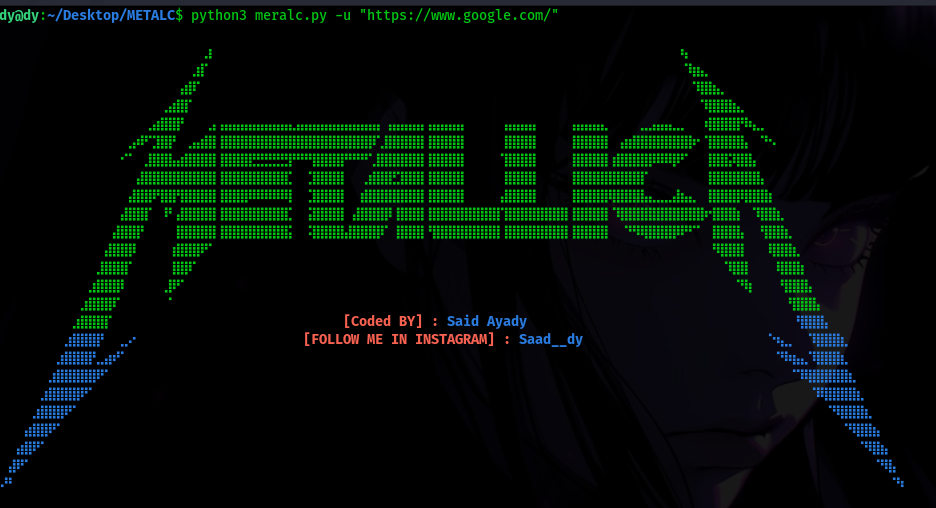

<h1 align="center">
  
  <br>
</h1>

<h4 align="center">METALC: A next-generation JavaScript crawling and spidering framework</h4>

<p align="center">
  <a href="https://github.com/Saad-Ayady/METALC"></a>
  <a href="https://github.com/Saad-Ayady/METALC/issues"></a>
  <a href="https://github.com/Saad-Ayady/METALC/releases"></a>
  <a href="https://x.com/SaadAyady"></a>
</p>

# Features

 - Fast And fully configurable web crawling
 - **Standard** and **Headless** mode
 - **JavaScript** parsing / crawling
 - Customizable **automatic form filling**
 - **Scope control** - Preconfigured field / Regex 
 - **Customizable output** - Preconfigured fields
 - INPUT - **STDIN**, **URL**
 - OUTPUT - **STDOUT**, **FILE**


## Installation 

this Tool using **python3** .

```sh
$ pip install requests
$ pip install beautifulsoup4
$ pip install colorama
$ pip install argparse
```

```sh 
$ git clone https://github.com/Saad-Ayady/METALC.git
$ cd METALC
$ python3 metalc.py -h
```

## Usage

```console
python3 metalc.py -h
```

```console
      -u  or --url   <URL>          Specify the URL for testing.
      -b  or --bread                 Call the brute force function.
      -w  or --word  <wordlist>      Specify the path to the wordlist.
      -o  or --output <FileSaving>   Output file to save links.
      -c  or --cook <Cookies>        Specify cookies for the crawling process.
      -h  or --help                  Show this help message.
```

## Running Katana 


#### URL Input

```sh
$ python3 metalc.py -u "URL"
```


#### URL Input And save 

```sh
$ python3 metalc.py -u "URL" -o "output.txt"
```

#### Brute Force 

```sh
$ python3 metalc.py -u "URL" -b 
$ python3 metalc.py -u "URL" -b -w "wordlist"
```

#### Crawling With Cookies

```sh
$ python3 metalc.py -u "URL" -c "COOKIES" 
```

#### Example running METALC 

```consol
$ python3 meralc.py -u "https://www.google.com/"

⠀⠀⠀⠀⠀⠀⠀⠀⠀⠀⠀⠀⠀⠀⠀⠀⠀⠀⠀⠀⠀⠀⠀⠀⠀⢀⡆⠀⠀⠀⠀⠀⠀⠀⠀⠀⠀⠀⠀⠀⠀⠀⠀⠀⠀⠀⠀⠀⠀⠀⠀⠀⠀⠀⠀⠀⠀⠀⠀⠀⠀⠀⠀⠀⠀⠀⠀⠀⠀⠀⠀⠀⠀⠀⠀⠀⠀⠀⠀⠀⠀⠀⠀⠀⠀⢦⠀⠀⠀⠀⠀⠀⠀⠀⠀⠀⠀⠀⠀⠀⠀⠀⠀⠀⠀⠀⠀⠀⠀⠀⠀⠀⠀
⠀⠀⠀⠀⠀⠀⠀⠀⠀⠀⠀⠀⠀⠀⠀⠀⠀⠀⠀⠀⠀⠀⠀⠀⣰⡏⠀⠀⠀⠀⠀⠀⠀⠀⠀⠀⠀⠀⠀⠀⠀⠀⠀⠀⠀⠀⠀⠀⠀⠀⠀⠀⠀⠀⠀⠀⠀⠀⠀⠀⠀⠀⠀⠀⠀⠀⠀⠀⠀⠀⠀⠀⠀⠀⠀⠀⠀⠀⠀⠀⠀⠀⠀⠀⠀⠈⢷⣦⡀⠀⠀⠀⠀⠀⠀⠀⠀⠀⠀⠀⠀⠀⠀⠀⠀⠀⠀⠀⠀⠀⠀⠀⠀
⠀⠀⠀⠀⠀⠀⠀⠀⠀⠀⠀⠀⠀⠀⠀⠀⠀⠀⠀⠀⠀⠀⢠⣾⠏⠀⠀⠀⠀⠀⠀⠀⠀⠀⠀⠀⠀⠀⠀⠀⠀⠀⠀⠀⠀⠀⠀⠀⠀⠀⠀⠀⠀⠀⠀⠀⠀⠀⠀⠀⠀⠀⠀⠀⠀⠀⠀⠀⠀⠀⠀⠀⠀⠀⠀⠀⠀⠀⠀⠀⠀⠀⠀⠀⠀⠀⠈⢿⣿⣦⡀⠀⠀⠀⠀⠀⠀⠀⠀⠀⠀⠀⠀⠀⠀⠀⠀⠀⠀⠀⠀⠀⠀
⠀⠀⠀⠀⠀⠀⠀⠀⠀⠀⠀⠀⠀⠀⠀⠀⠀⠀⠀⠀⢀⣴⣿⡏⠀⠀⠀⠀⠀⠀⠀⠀⠀⠀⠀⠀⠀⠀⠀⠀⠀⠀⠀⠀⠀⠀⠀⠀⠀⠀⠀⠀⠀⠀⠀⠀⠀⠀⠀⠀⠀⠀⠀⠀⠀⠀⠀⠀⠀⠀⠀⠀⠀⠀⠀⠀⠀⠀⠀⠀⠀⠀⠀⠀⠀⠀⠀⠈⢿⣿⣿⣷⣄⠀⠀⠀⠀⠀⠀⠀⠀⠀⠀⠀⠀⠀⠀⠀⠀⠀⠀⠀⠀
⠀⠀⠀⠀⠀⠀⠀⠀⠀⠀⠀⠀⠀⠀⠀⠀⠀⠀⢀⣴⣿⣿⡟⠀⠀⠀⣠⢠⣤⣤⣤⣤⣤⣤⣤⣤⣄⣤⣤⣤⣤⣤⣤⣤⣤⣤⣤⡄⢠⣤⣤⣤⣤⢠⣤⣤⣤⣤⠀⠀⠀⠀⠀⣤⣤⣤⣤⠀⠀⠀⠀⢠⣤⣤⣤⣄⠀⠀⠀⠀⣀⣠⣤⣤⣀⡀⠀⠀⢾⣿⣿⣿⡟⠷⣄⡀⠀⠀⠀⠀⠀⠀⠀⠀⠀⠀⠀⠀⠀⠀⠀⠀⠀
⠀⠀⠀⠀⠀⠀⠀⠀⠀⠀⠀⠀⠀⠀⠀⠀⣠⠾⠋⣹⣿⡟⠀⢀⣤⣾⣿⢸⣿⣿⣿⣿⣿⣿⣿⣿⣿⣿⣿⣿⣿⣿⣿⣿⣿⣿⡿⢁⣿⣿⣿⣿⣿⢸⣿⣿⣿⣿⠀⠀⠀⠀⠀⣿⣿⣿⣿⠀⠀⠀⠀⢸⣿⣿⣿⣿⠀⢠⣶⣿⣿⣿⣿⣿⣿⣿⡷⠂⢹⣿⣿⣿⣿⡄⠀⠙⠢⠀⠀⠀⠀⠀⠀⠀⠀⠀⠀⠀⠀⠀⠀⠀⠀
⠀⠀⠀⠀⠀⠀⠀⠀⠀⠀⠀⠀⠀⠀⠀⠊⠁⠀⣸⣿⣿⣧⣴⣿⣿⣿⣿⢸⣿⣿⣿⣟⣛⣛⣛⣛⡟⠛⠛⣿⣿⣿⣿⠛⠛⠛⢁⣿⣿⣿⣿⣿⣿⢸⣿⣿⣿⣿⠀⠀⠀⠀⠈⣿⣿⣿⣿⠀⠀⠀⠀⢸⣿⣿⣿⣿⢰⣿⣿⣿⣿⡿⠿⠿⡿⠋⠀⠀⢸⣿⣿⡽⣿⣿⡄⠀⠀⠀⠀⠀⠀⠀⠀⠀⠀⠀⠀⠀⠀⠀⠀⠀⠀
⠀⠀⠀⠀⠀⠀⠀⠀⠀⠀⠀⠀⠀⠀⠀⠀⠀⣼⣿⣿⣿⣿⣿⣿⣿⣿⣿⢸⣿⣿⣿⣿⣿⣿⣿⣿⡁⠀⢈⣿⣿⣿⣿⠀⠀⢀⣾⣿⣿⣋⣿⣿⣿⢸⣿⣿⣿⣿⠀⠀⠀⠀⠀⣿⣿⣿⣿⠀⠀⠀⠀⢸⣿⣿⣿⣿⣿⣿⣿⣿⡏⠀⠀⠀⠀⠀⠀⠀⢸⣿⣿⣿⣿⣿⣿⡄⠀⠀⠀⠀⠀⠀⠀⠀⠀⠀⠀⠀⠀⠀⠀⠀⠀
⠀⠀⠀⠀⠀⠀⠀⠀⠀⠀⠀⠀⠀⠀⠀⠀⣼⣿⣿⠟⣿⣿⢻⣿⣿⣿⣿⢸⣿⣿⣿⠿⠿⠿⠿⠿⡇⠀⢈⣿⣿⣿⣿⠀⠀⣾⣿⣿⣿⣿⣿⣿⣿⢸⣿⣿⣿⣿⠀⠀⠀⠀⢠⣿⣿⣿⣿⠀⠀⠀⠀⢸⣿⣿⣿⣿⢿⣿⣿⣿⣧⣄⣀⣀⣼⣦⣄⠀⢸⣿⣿⣿⡿⣿⣿⣿⡆⠀⠀⠀⠀⠀⠀⠀⠀⠀⠀⠀⠀⠀⠀⠀⠀
⠀⠀⠀⠀⠀⠀⠀⠀⠀⠀⠀⠀⠀⠀⠀⣼⣿⣿⡏⠀⠸⠃⣼⣿⣿⣿⣿⢸⣿⣿⣿⣿⣿⣿⣿⣿⡁⠀⢨⣿⣿⣿⣿⠀⣼⣿⣿⣿⡿⢸⣿⣿⣿⢸⣿⣿⣿⣿⣿⣿⣿⣿⡏⣿⣿⣿⣿⣿⣿⣿⣿⢸⣿⣿⣿⣿⠈⢿⣿⣿⣿⣿⣿⣿⣿⣿⣿⣿⠖⣿⣿⣿⡆⠀⠹⣿⣿⣆⠀⠀⠀⠀⠀⠀⠀⠀⠀⠀⠀⠀⠀⠀⠀
⠀⠀⠀⠀⠀⠀⠀⠀⠀⠀⠀⠀⠀⠀⣼⣿⣿⡟⠀⠀⠀⠀⣿⣿⣿⣿⣿⢸⣿⣿⣿⣿⣿⣿⣿⣿⡅⠀⠨⣿⣿⣿⣿⣼⣿⣿⣿⡿⠁⢸⣿⣿⣿⠘⣿⣿⣿⣿⣿⣿⣿⣿⡇⣿⣿⣿⣿⣿⣿⣿⣿⢸⣿⣿⣿⣿⠀⠀⠙⠻⢿⣿⣿⣿⡿⠟⠋⠁⠀⣿⣿⣿⣧⠀⠀⢻⣿⣿⣆⠀⠀⠀⠀⠀⠀⠀⠀⠀⠀⠀⠀⠀⠀
⠀⠀⠀⠀⠀⠀⠀⠀⠀⠀⠀⠀⠀⣼⣿⣿⡿⠀⠀⠀⠀⢰⣿⣿⣿⠟⠁⠀⠀⠀⠀⠀⠀⠀⠀⠀⠀⠀⠀⠀⠀⠀⠀⠀⠀⠀⠀⠀⠀⠀⠀⠀⠀⠀⠀⠀⠀⠀⠀⠀⠀⠀⠀⠀⠀⠀⠀⠀⠀⠀⠀⠀⠀⠀⠀⠀⠀⠀⠀⠀⠀⠀⠀⠀⠀⠀⠀⠀⠀⠻⣿⣿⣿⠀⠀⠀⢿⣿⣿⣆⠀⠀⠀⠀⠀⠀⠀⠀⠀⠀⠀⠀⠀
⠀⠀⠀⠀⠀⠀⠀⠀⠀⠀⠀⠀⣸⣿⣿⣿⠁⠀⠀⠀⠀⢸⣿⡿⠁⠀⠀⠀⠀⠀⠀⠀⠀⠀⠀⠀⠀⠀⠀⠀⠀⠀⠀⠀⠀⠀⠀⠀⠀⠀⠀⠀⠀⠀⠀⠀⠀⠀⠀⠀⠀⠀⠀⠀⠀⠀⠀⠀⠀⠀⠀⠀⠀⠀⠀⠀⠀⠀⠀⠀⠀⠀⠀⠀⠀⠀⠀⠀⠀⠀⠈⢿⣿⡇⠀⠀⠀⢿⣿⣿⡆⠀⠀⠀⠀⠀⠀⠀⠀⠀⠀⠀⠀
⠀⠀⠀⠀⠀⠀⠀⠀⠀⠀⠀⣰⣿⣿⣿⠇⠀⠀⠀⠀⢀⡿⠋⠀⠀⠀⠀⠀⠀⠀⠀⠀⠀⠀⠀⠀⠀⠀⠀⠀⠀⠀⠀⠀⠀⠀⠀⠀⠀⠀⠀⠀⠀⠀⠀⠀⠀⠀⠀⠀⠀⠀⠀⠀⠀⠀⠀⠀⠀⠀⠀⠀⠀⠀⠀⠀⠀⠀⠀⠀⠀⠀⠀⠀⠀⠀⠀⠀⠀⠀⠀⠀⠙⢷⠀⠀⠀⠘⣿⣿⣿⡄⠀⠀⠀⠀⠀⠀⠀⠀⠀⠀⠀
⠀⠀⠀⠀⠀⠀⠀⠀⠀⠀⣰⣿⣿⣿⠏⠀⠀⠀⠀⠀⠀⠁⠀⠀⠀⠀⠀⠀⠀⠀⠀⠀⠀⠀⠀⠀⠀⠀⠀⠀⠀⠀⠀⠀⠀⠀⠀⠀⠀⠀⠀⠀⠀⠀⠀⠀⠀⠀⠀⠀⠀⠀⠀⠀⠀⠀⠀⠀⠀⠀⠀⠀⠀⠀⠀⠀⠀⠀⠀⠀⠀⠀⠀⠀⠀⠀⠀⠀⠀⠀⠀⠀⠀⠀⠀⠀⠀⠀⠘⣿⣿⣿⡄⠀⠀⠀⠀⠀⠀⠀⠀⠀⠀
⠀⠀⠀⠀⠀⠀⠀⠀⠀⣰⣿⣿⣿⡏⠀⠀⠀⠀⠀⠀⠀⠀⠀⠀⠀⠀⠀⠀⠀⠀⠀⠀⠀⠀⠀⠀⠀⠀⠀⠀⠀  [Coded BY] : Said Ayady ⠀⠀⠀⠀⠀⠀⠀⠀⠀⠀⠀⠀⠀⠀⠀⠀      ⠀⠀⠀⠀⠀⠀   ⠀⠘⣿⣿⣿⡄⠀⠀⠀⠀⠀⠀⠀⠀⠀
⠀⠀⠀⠀⠀⠀⠀⠀⣰⣿⣿⣿⡟⠀⠀⣀⠔⠀⠀⠀⠀⠀⠀⠀⠀⠀⠀⠀⠀⠀        [FOLLOW ME IN INSTAGRAM] :⠀Saad__dy⠀⠀⠀⠀⠀⠀⠀⠀⠀⠀⠀⠀⠀⠀  ⠀   ⠀⠀⠀⠑⢦⣀⠀⠀⠹⣿⣿⣿⣆⠀⠀⠀⠀⠀⠀⠀⠀
⠀⠀⠀⠀⠀⠀⠀⣰⣿⣿⣿⡟⣀⣴⠞⠁⠀⠀⠀⠀⠀⠀⠀⠀⠀⠀⠀⠀⠀⠀⠀⠀⠀⠀⠀⠀⠀⠀⠀⠀⠀⠀⠀⠀⠀⠀⠀⠀⠀⠀⠀⠀⠀⠀⠀⠀⠀⠀⠀⠀⠀⠀⠀⠀⠀⠀⠀⠀⠀⠀⠀⠀⠀⠀⠀⠀⠀⠀⠀⠀⠀⠀⠀⠀⠀⠀⠀⠀⠀⠀⠀⠀⠀⠀⠀⠀⠀⠙⠷⣦⣄⠹⣿⣿⣿⣆⠀⠀⠀⠀⠀⠀⠀
⠀⠀⠀⠀⠀⠀⣰⣿⣿⣿⣿⣿⠟⠁⠀⠀⠀⠀⠀⠀⠀⠀⠀⠀⠀⠀⠀⠀⠀⠀⠀⠀⠀⠀⠀⠀⠀⠀⠀⠀⠀⠀⠀⠀⠀⠀⠀⠀⠀⠀⠀⠀⠀⠀⠀⠀⠀⠀⠀⠀⠀⠀⠀⠀⠀⠀⠀⠀⠀⠀⠀⠀⠀⠀⠀⠀⠀⠀⠀⠀⠀⠀⠀⠀⠀⠀⠀⠀⠀⠀⠀⠀⠀⠀⠀⠀⠀⠀⠀⠉⠿⣿⣿⣿⣿⣿⣆⠀⠀⠀⠀⠀⠀
⠀⠀⠀⠀⠀⣰⣿⣿⣿⣿⠟⠁⠀⠀⠀⠀⠀⠀⠀⠀⠀⠀⠀⠀⠀⠀⠀⠀⠀⠀⠀⠀⠀⠀⠀⠀⠀⠀⠀⠀⠀⠀⠀⠀⠀⠀⠀⠀⠀⠀⠀⠀⠀⠀⠀⠀⠀⠀⠀⠀⠀⠀⠀⠀⠀⠀⠀⠀⠀⠀⠀⠀⠀⠀⠀⠀⠀⠀⠀⠀⠀⠀⠀⠀⠀⠀⠀⠀⠀⠀⠀⠀⠀⠀⠀⠀⠀⠀⠀⠀⠀⠈⠿⣿⣿⣿⣿⣆⠀⠀⠀⠀⠀
⠀⠀⠀⠀⣰⣿⣿⣿⠟⠁⠀⠀⠀⠀⠀⠀⠀⠀⠀⠀⠀⠀⠀⠀⠀⠀⠀⠀⠀⠀⠀⠀⠀⠀⠀⠀⠀⠀⠀⠀⠀⠀⠀⠀⠀⠀⠀⠀⠀⠀⠀⠀⠀⠀⠀⠀⠀⠀⠀⠀⠀⠀⠀⠀⠀⠀⠀⠀⠀⠀⠀⠀⠀⠀⠀⠀⠀⠀⠀⠀⠀⠀⠀⠀⠀⠀⠀⠀⠀⠀⠀⠀⠀⠀⠀⠀⠀⠀⠀⠀⠀⠀⠀⠈⠻⣿⣿⣿⣆⠀⠀⠀⠀
⠀⠀⠀⣴⣿⣿⠟⠁⠀⠀⠀⠀⠀⠀⠀⠀⠀⠀⠀⠀⠀⠀⠀⠀⠀⠀⠀⠀⠀⠀⠀⠀⠀⠀⠀⠀⠀⠀⠀⠀⠀⠀⠀⠀⠀⠀⠀⠀⠀⠀⠀⠀⠀⠀⠀⠀⠀⠀⠀⠀⠀⠀⠀⠀⠀⠀⠀⠀⠀⠀⠀⠀⠀⠀⠀⠀⠀⠀⠀⠀⠀⠀⠀⠀⠀⠀⠀⠀⠀⠀⠀⠀⠀⠀⠀⠀⠀⠀⠀⠀⠀⠀⠀⠀⠀⠈⠻⣿⣿⣦⠀⠀⠀
⠀⠀⣴⣿⠟⠁⠀⠀⠀⠀⠀⠀⠀⠀⠀⠀⠀⠀⠀⠀⠀⠀⠀⠀⠀⠀⠀⠀⠀⠀⠀⠀⠀⠀⠀⠀⠀⠀⠀⠀⠀⠀⠀⠀⠀⠀⠀⠀⠀⠀⠀⠀⠀⠀⠀⠀⠀⠀⠀⠀⠀⠀⠀⠀⠀⠀⠀⠀⠀⠀⠀⠀⠀⠀⠀⠀⠀⠀⠀⠀⠀⠀⠀⠀⠀⠀⠀⠀⠀⠀⠀⠀⠀⠀⠀⠀⠀⠀⠀⠀⠀⠀⠀⠀⠀⠀⠀⠈⠻⣿⣦⠀⠀
⠀⣼⠟⠁⠀⠀⠀⠀⠀⠀⠀⠀⠀⠀⠀⠀⠀⠀⠀⠀⠀⠀⠀⠀⠀⠀⠀⠀⠀⠀⠀⠀⠀⠀⠀⠀⠀⠀⠀⠀⠀⠀⠀⠀⠀⠀⠀⠀⠀⠀⠀⠀⠀⠀⠀⠀⠀⠀⠀⠀⠀⠀⠀⠀⠀⠀⠀⠀⠀⠀⠀⠀⠀⠀⠀⠀⠀⠀⠀⠀⠀⠀⠀⠀⠀⠀⠀⠀⠀⠀⠀⠀⠀⠀⠀⠀⠀⠀⠀⠀⠀⠀⠀⠀⠀⠀⠀⠀⠀⠈⠻⣧⠀
⠜⠃⠀⠀⠀⠀⠀⠀⠀⠀⠀⠀⠀⠀⠀⠀⠀⠀⠀⠀⠀⠀⠀⠀⠀⠀⠀⠀⠀⠀⠀⠀⠀⠀⠀⠀⠀⠀⠀⠀⠀⠀⠀⠀⠀⠀⠀⠀⠀⠀⠀⠀⠀⠀⠀⠀⠀⠀⠀⠀⠀⠀⠀⠀⠀⠀⠀⠀⠀⠀⠀⠀⠀⠀⠀⠀⠀⠀⠀⠀⠀⠀⠀⠀⠀⠀⠀⠀⠀⠀⠀⠀⠀⠀⠀⠀⠀⠀⠀⠀⠀⠀⠀⠀⠀⠀⠀⠀⠀⠀⠀⠈⠳
    

[Crawlink HMTL link]
--------------------
https://support.google.com/accounts?p=signin_privatebrowsing&hl=en-US
https://support.google.com/accounts?hl=en-US&p=account_iph
https://accounts.google.com/TOS?loc=MA&hl=en-US&privacy=true
https://accounts.google.com/TOS?loc=MA&hl=en-US
https://www.gstatic.com
https://www.google.co.ma/intl/fr/about/products?tab=ih
https://accounts.google.com/ServiceLogin?hl=fr&passive=true&continue=https://www.google.com/imghp%3Fhl%3Dfr%26ogbl&ec=GAZAAg
https://about.google/?utm_source=google-MA&utm_medium=referral&utm_campaign=hp-footer&fg=1
https://www.google.com/intl/fr_ma/ads/?subid=ww-ww-et-g-awa-a-g_hpafoot1_1!o2&utm_source=google.com&utm_medium=referral&utm_campaign=google_hpafooter&fg=1
https://www.google.com/services/?subid=ww-ww-et-g-awa-a-g_hpbfoot1_1!o2&utm_source=google.com&utm_medium=referral&utm_campaign=google_hpbfooter&fg=1
https://google.com/search/howsearchworks/?fg=1
https://policies.google.com/privacy?hl=fr-MA&fg=1
https://policies.google.com/terms?hl=fr-MA&fg=1
https://www.google.com/preferences?hl=fr-MA&fg=1
https://www.google.com/advanced_image_search?hl=fr-MA&fg=1
https://www.google.com/history/optout?hl=fr-MA&fg=1
https://support.google.com/websearch/?p=ws_results_help&hl=fr-MA&fg=1
https://www.google.com/xjs/_/ss/k=xjs.s.COY7YZf2XXc.L.F4.O/am=AAAAAAAAAAAAAAAAAKAAAAAAAAAAAAAAAAAAAAAAAAAAAAAAAAIAAAAEAAAAAAAAAAAAAAARAAACCAAAAAgBAAA7AAAAAAAABEIAAAIAAAAAQACQAAAAgAACAAFAAQAAABAAAAAAQQAAAAEAHAAAIAAAIAAAAAiAAQAMAAAAEAAiBAQAIAANAChAACQAEDgAggcACggAgAAAEAAAAAlwAIYBEFQADAAAIAAAAAAAAAAAAABAAIAQAAABUAAAMAAAoAeAAPABAEiCAAAwBABAAEAAAAAAAAQAAAAAIAAAAQAAYAoAw8AABAAAAAAAAAAJAAAAAAAAAAAAAAAAAAAAAAAAAAAgAAAAACAAAAAAAAAAAAAAAAAAAAAAAEA/d=1/ed=1/br=1/rs=ACT90oFtR0JCaEzqM5NPLrbdVUOt3sCqJQ/m=cdos,hsm,jsa,mb4ZUb,cEt90b,SNUn3,qddgKe,sTsDMc,dtl0hd,eHDfl,YV5bee,d,csi
https://www.google.co.ma/intl/fr/about/products#page-content
```